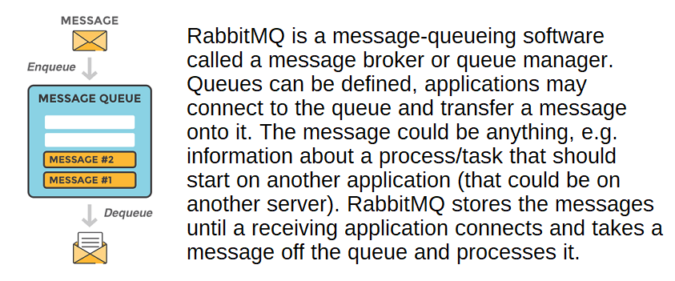
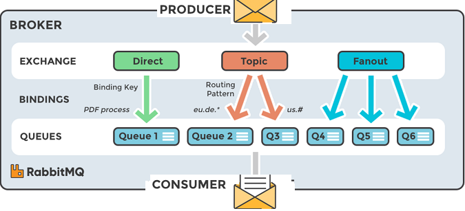

A message broker can be used to reduce loads and delivery times by web application servers since tasks, which would normally
take quite a bit of time to process, can be delegated to a third party whose only job is to perform them.

Message queueing allows web servers to respond to requests quickly instead of being forced to perform resource-heavy procedures
on the spot. Message queueing is also good when you want to distribute a message to multiple recipients for consumption or for
balancing loads between workers.

RabbitMQ has many features and supports multiple protocols, e.g. AMQP.

**Types of exchanges**

- Direct: delivers messages to queues whose binding key exactly matches the routing key of the message. E.g. if the queue is bound
to the exchange with the binding key *pdfprocess*, a message published to the exchange with a routing key *pdfprocess* is routed to that queue.
- Fanout: all of the queues that are bound to it.
- Topic: wildcard match between the routing key and the routing pattern specified in the binding.
- Headers: use the message header attributes for routing.

