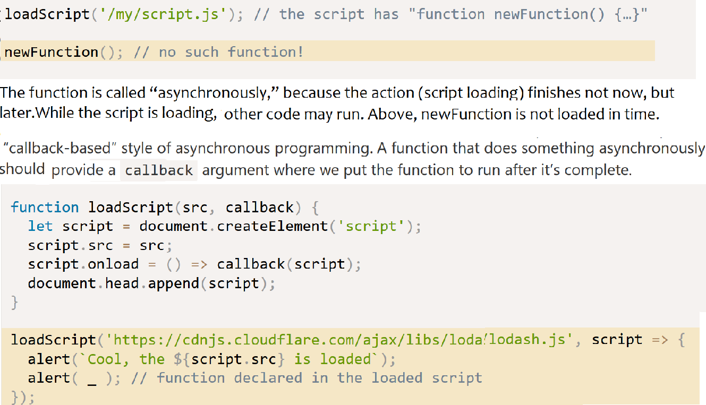
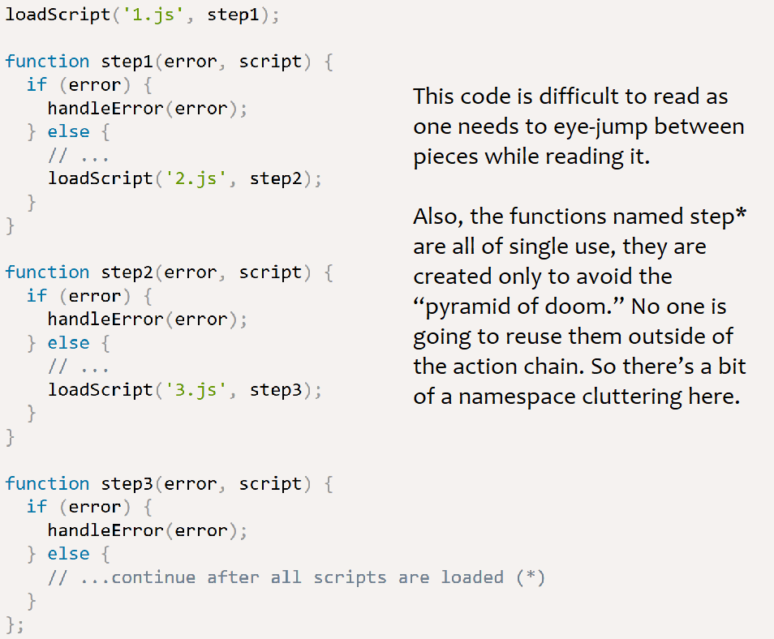
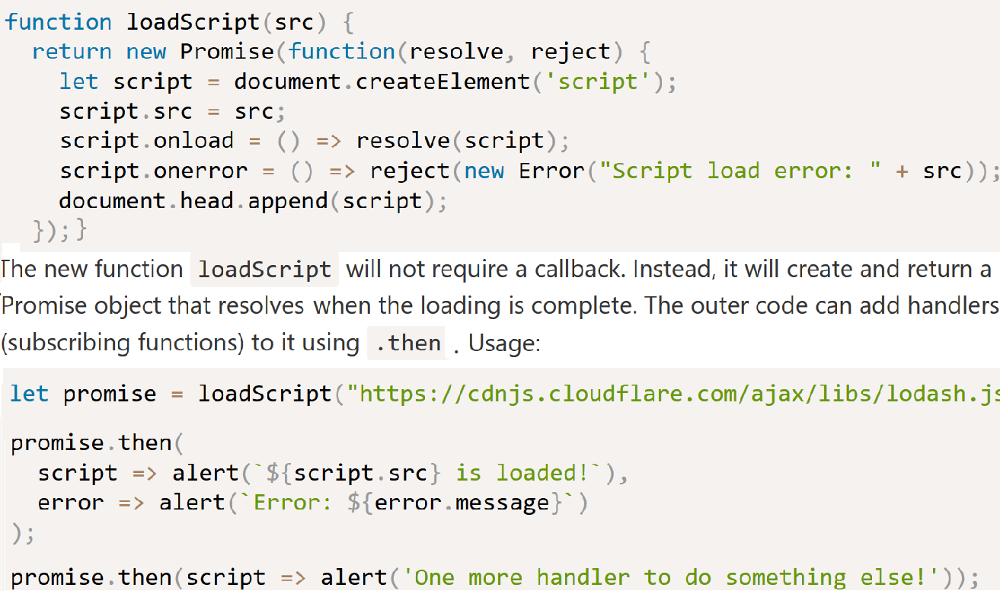
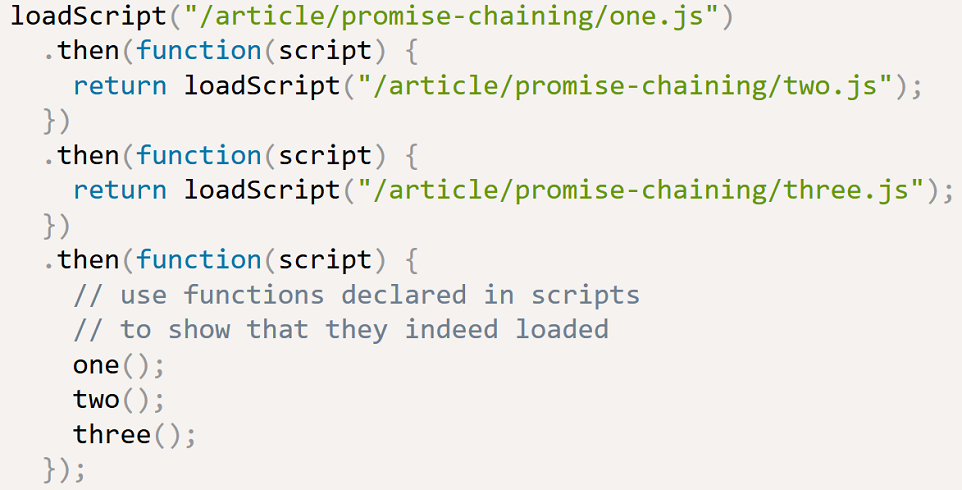
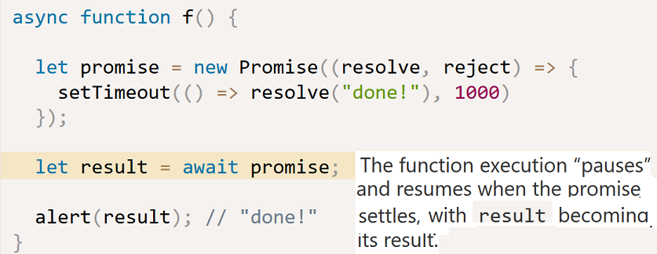
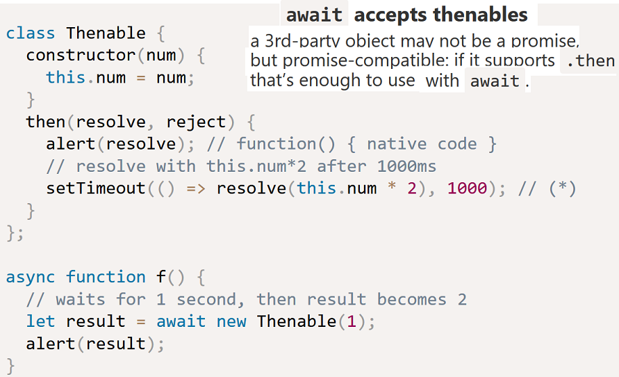

**Introduction: callbacks**

To handle errors:

    function loadScript(src, callback) {
      let script = document.createElement('script');
      script.src = src;

      script.onload = () => callback(null, script);
      script.onerror = () => callback(new Error(`Script load error for ${src}`));

      document.head.append(script);
    }

Here, So the single callback function is used both for reporting errors and passing back results.

**Callback hell**

The above style is fine for one or maybe two nested calls.
But for multiple asynchronous actions that follow one after another we’ll have code like this:

    loadScript('1.js', function(error, script) {
      if (error) {
        handleError(error);
      } else {
        // ...
        loadScript('2.js', function(error, script) {
          if (error) {
            handleError(error);
          } else {
            // ...
            loadScript('3.js', function(error, script) {
              if (error) {
                handleError(error);
              } else {
                // ...continue after all scripts are loaded (*)
              } ...

As calls become more nested, the code becomes deeper and increasingly more difficult to manage, especially if we have a real code instead of '...', that may include more loops, conditional statements etc.

We can try to alleviate the problem by making every action a standalone function, like this:

**Promise basics**

    let promise = new Promise(function(resolve, reject) {
      // executor (the producing code)
    });

The function passed to `new Promise` is called the *executor*. When the promise is created, this executor function runs automatically. It contains the producing code, that should eventually produce a result.

The resulting promise object has internal properties: state and result.
When the executor finishes the job, it should call one of the functions that it gets as arguments

The executor should call only one resolve or reject. The promise’s state change is final.
All further calls of resolve and reject are ignored. The idea is that a job done by the executor may have only one result or an error.
Further, resolve/reject expect only one argument and will ignore additional arguments.

Consumers: “then” and “catch”
---------------------------
A `Promise` object serves as a link between the executor (the “producing code”) and the consuming functions, which will receive the result or error. Consuming functions can be registered (subscribed) using the methods `.then` and `.catch`.

If we’re interested only in successful completions, then we can provide only one function argument to `.then`

If we’re interested only in errors, then we can use `null` as the first argument: `.then(null, errorHandlingFunction)`. Or we can use `.catch(errorHandlingFunction)`, which is exactly the same.

The call `.catch(f)` is a complete analog of `.then(null, f)`, it’s just a shorthand.

**On settled promises then runs immediately**

If a promise is pending, .then/catch handlers wait for the result. Otherwise, if a promise has already settled, they execute immediately:

    // an immediately resolved promise
    let promise = new Promise(resolve => resolve("done!"));
    promise.then(alert); // done! (shows up right now)

Some tasks may sometimes require time and sometimes finish immediately. The good thing is: the .then handler is guaranteed to run in both cases.

**Handlers of .then/.catch are always asynchronous**

Even when the Promise is immediately resolved, code which occurs on lines below your `.then/.catch` may still execute first.

The following example is the above callback example re-written:

Promises chaining
-----------------

The whole thing works, because a call to `promise.then` returns a promise, so that we can call the next `.then` on it.

When a handler returns a value, it becomes the result of that promise, so the next `.then` is called with it.

**Returning promises**

Normally, a value returned by a .then handler is immediately passed to the next handler. But there’s an exception.

If the returned value is a promise, then the further execution is suspended until it settles. After that, the result of that promise is given to the next .then handler.

**Example: `loadScript`**

Using this feature with `loadScript` to load scripts one by one, in sequence:

Here each `loadScript` call returns a promise, and the next `.then` runs when it resolves. Then it initiates the loading of the next script. So scripts are loaded one after another.

We can add more asynchronous actions to the chain. Note the code is still “flat”, it grows down, not to the right. There are no signs of "callback hell".

**Error handling**

When a promise rejects, e.g. `fetch` fails if the remote server is not available, the control jumps to the closest rejection handler down the chain.

If we throw inside `.then` handler, that means a rejected promise, so the control jumps to the nearest error handler.
That’s so not only for throw, but for any errors, including programming errors as well:

    new Promise(function(resolve, reject) {
      resolve("ok");
    }).then(function(result) {
      blabla(); // no such function
    }).catch(alert); // ReferenceError: blabla is not defined

`.catch` behaves like `try..catch`. We may have as many `.then` as we want, and then use a single `.catch` at the end to handle errors in all of them.

In a regular `try..catch` we can analyze the error and maybe rethrow it if can’t handle. The same thing is possible for promises.

Async/await
-----------
The keyword `async` before a function means one simple thing: a function always returns a promise.
i.e. the functions return value is wrapped in a resolved promise.

    async function f() {
      return 1;
    }

    f().then(alert); // 1

The keyword `await` makes JavaScript wait until that promise settles and returns its result.

`await` literally makes JS wait until the promise settles, and then go on with the result. That doesn’t cost any CPU resources, because the engine can do other jobs meanwhile: execute other scripts, handle events etc.

It’s just a more elegant syntax of getting the promise result than `promise.then`. Note that we need to have a wrapping async function for the code that awaits.

**Summaru**

The async keyword before a function has two effects: Makes it always return a promise. Allows to use `await` in it.
The `await` keyword before a promise makes JavaScript wait until that promise settles
Together they provide a great framework to write asynchronous code that is easy both to read and write.

With `async/await` we rarely need to write `promise.then/catch`, but we still shouldn’t forget that they are based on promises, because sometimes (e.g. in the outermost scope) we have to use these methods

