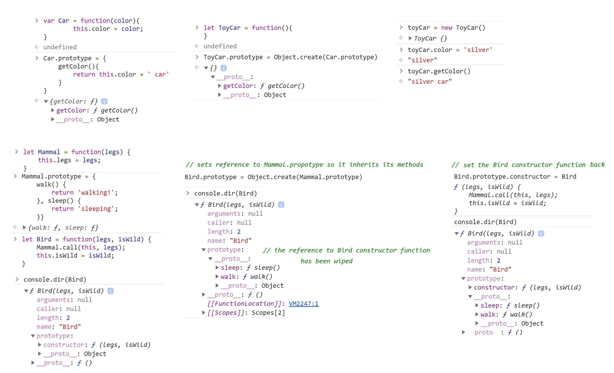
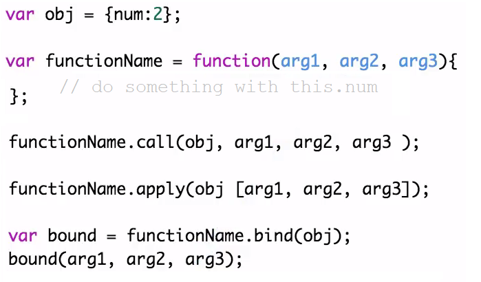
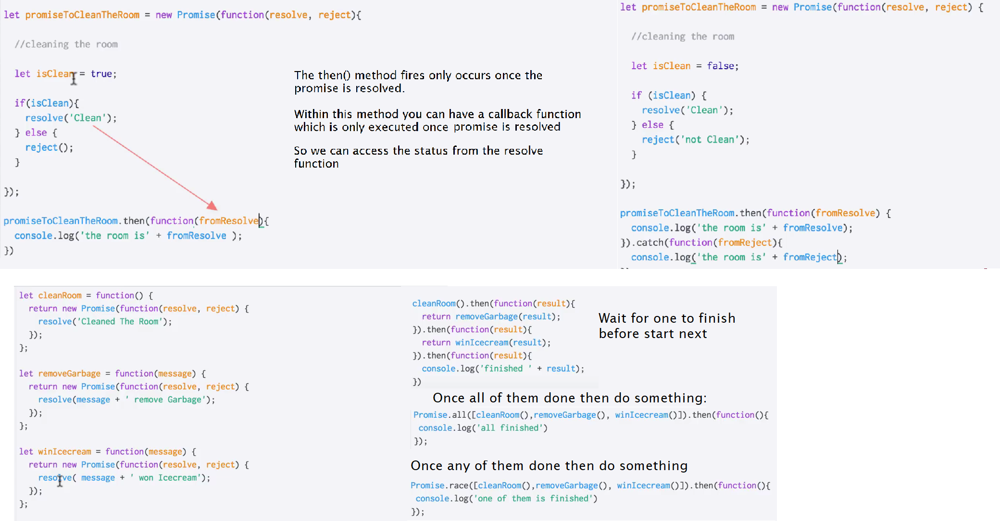

Object
------

    // Object initialiser or literal
    { [ nameValuePair1[, nameValuePair2[, ...nameValuePairN] ] ] }

    // Called as a constructor
    new Object([value])

When called in a non-constructor context, `Object` behaves identically to `new Object()`.

The `Object` constructor creates an object wrapper.

`Object.prototype.constructor`
    Specifies the function that creates an object's prototype.

`Object.prototype.__proto__`
    Points to the object which was used as prototype when the object was instantiated.

`Object.prototype.valueOf()`

    greenCar.valueOf('color')  // Car {color: "green"}

The class keyword was introduced in 2015, they are same as those created with function constructors with prototype methods:

**Extending function constructors**

`Object.create()` lets you extend a constructor. Whereas in classical inheritance where you extend another class and effectively copy across its methods, here you just set a reference from a subclass to the base class, so it is just a prototype reference.

**Custom objects continued**

Consider the following:

    function Person(first, last) {
      this.first = first;
      this.last = last;
      this.fullName = function() {
        return this.first + ' ' + this.last;
      };
      this.fullNameReversed = function() {
        return this.last + ', ' + this.first;
      };
    }
    var s = new Person('Simon', 'Willison');

`new` is strongly related to `this`. It creates a brand new empty object, and then calls the function specified, with `this` set to that new object. Notice though that the function specified with `this` does not return a value but merely modifies the `this` object. It's new that returns the `this` object to the calling site. Functions that are designed to be called by `new` are called constructor functions. Common practice is to capitalize these functions as a reminder to call them with `new`.

Every time we create a person object we are creating two brand new function objects within it — wouldn't it be better if this code was shared? We can do better:

    function Person(first, last) {
      this.first = first;
      this.last = last;
    }
    Person.prototype.fullName = function() {
      return this.first + ' ' + this.last;
    };
    Person.prototype.fullNameReversed = function() {
      return this.last + ', ' + this.first;
    };

`Person.prototype` is an object shared by all instances of `Person`. It forms part of a lookup chain (that has a special name, "prototype chain"): any time you attempt to access a property of `Person` that isn't set, JavaScript will check `Person.prototype` to see if that property exists there instead.

Function
--------

Function objects inherit from `Function.prototype`. This object has the following methods:

`Function.prototype.apply()`
    Calls a function and sets its `this` to the provided value, arguments can be passed as an Array object.

`Function.prototype.call()`
    Calls (executes) a function and sets its `this` to the provided value, arguments can be passed as they are.

Difference between the above: `apply` lets you invoke the function with arguments as an array; `call` requires the parameters be listed explicitly.

`Function.prototype.bind()`
    Creates a new function which, when called, has its this set to the provided value, with a given sequence of arguments preceding any provided when the new function was called.

**Inner functions and Closures**

An important detail of nested functions in JavaScript is that they can access variables in their parent function's scope:

    function parentFunc() {
      var a = 1;

      function nestedFunc() {
        var b = 4; // parentFunc can't use this
        return a + b;
      }
      return nestedFunc(); // 5
    }

If a called function relies on one or two other functions that are not useful to any other part of your code, you can nest those utility functions inside it. This keeps the number of functions that are in the global scope down, which is always a good thing.
When writing complex code it is often tempting to use global variables to share values between multiple functions — which leads to code that is hard to maintain. Nested functions can share variables in their parent, so you can use that mechanism to couple functions together when it makes sense without polluting your global namespace — "local globals" if you like.

    function makeAdder(a) {
      return function(b) {
        return a + b;
      };
    }
    var x = makeAdder(5);
    var y = makeAdder(20);
    x(6); // returns 11
    y(7); // returns 27

Here's what's actually happening. Whenever JavaScript executes a function, a 'scope' object is created to hold the local variables created within that function. It is initialized with any variables passed in as function parameters.

So when `makeAdder()` is called, a scope object is created with one property: `a`, which is the argument passed to `makeAdder()` which returns a newly created function. Normally JavaScript's garbage collector would clean up the scope object created for `makeAdder()` at this point, but the returned function maintains a reference back to that scope object. As a result, the scope object will not be garbage-collected until there are no more references to the function object that `makeAdder()` returned.

Scope objects form a chain called the scope chain, similar to the prototype chain used by JavaScript's object system.

A closure is the combination of a function and the scope object in which it was created. Closures let you save state — as such, they can often be used in place of objects.

    function foo(x) {
      var tmp = 3;
      function bar(y) {
        console.log(x + y + (++tmp)); // will log 16
      }
      bar(10);
    }
    foo(2);  // 16

Whenever you see the function keyword within another function, the inner function has access to variables in the outer function.

That is a closure. A function doesn't have to return in order to be called a closure. Simply accessing variables outside of your immediate lexical scope creates a closure.  JS function creates a closure.

    function sayHello2(name) {
        var text = 'Hello ' + name; // Local variable
        var say = function() { console.log(text); }
        return say;
    }
    var say2 = sayHello2('Bob');
    say2(); // logs "Hello Bob"

When a function (foo) declares other functions (bar and baz), the family of local variables created in foo is not destroyed when the function exits. The variables merely become invisible to the outside world. Foo can therefore cunningly return the functions bar and baz, and they can continue to read, write and communicate with each other through this closed-off family of variables ("the closure") that nobody else can meddle with, not even someone who calls foo again in future.

A closure is one way of supporting first-class functions; it is an expression that can reference variables within its scope (when it was first declared), be assigned to a variable, be passed as an argument to a function, or be returned as a function result.

**Promises**

Numbers
-------
"double-precision 64-bit format IEEE 754 values", there's no such thing as an integer in JS; In practice, integer values are treated as 32-bit ints.

The `parseInt()` and `parseFloat()` functions parse a string until they reach a character that isn't valid for the specified number format, then return the number parsed up to that point.

You can convert a string to an integer using the built-in parseInt() function. This takes the base for the conversion as an optional second argument, which you should always provide:

    parseInt('123', 10); // 123
    parseInt('010', 10); // 10
    parseInt('0x10'); // 16  treated as hexadecimal due to the leading "0x"
    parseInt('11', 2); // 3  convert a binary number to an integer

Similarly there is `parseFloat()` which, unlike `parseInt()`, always uses base 10.

String
------

    'foobar'.includes('foo')  \\ true
    ' foo'.concat('bar').trim()  \\ "foobar"
    ' foobar '.trimRight() \\ " foobar"

Various string methods, similar to in Python. Regex methods include `match()` and `search()`:

    var str = 'ABCDEFGHIJKLMNOPQRSTUVWXYZabcdefghijklmnopqrstuvwxyz';
    var regexp = /[A-E]/gi;
    console.log(str.match(regexp));
    // ['A', 'B', 'C', 'D', 'E', 'a', 'b', 'c', 'd', 'e']

If the regular expression includes the `g` flag, the method returns an `Array` containing all matched substrings rather than match objects.

    var my_str2 = 'my string was 25chars now its 40chars'
    my_str2.match(/[0-9]{2}[a-z]{4}/)
    // ["25char", index: 14, input: "my string was 25chars now its 40chars", groups: undefined]

    my_str2.match(/[0-9]{2}[a-z]{4}/g)
    // (2) ["25char", "40char"]

    my_str2.search(/[0-9]{2}[a-z]{4}/g)
    // 14

**String conversion**

It's possible to use String as a more reliable toString() alternative, as it works when used on null, undefined, and on symbols. For example:

    var outputStrings = [];
    for (var i = 0, n = inputValues.length; i < n; ++i) {
      outputStrings.push(String(inputValues[i]));
    }

Array
-----
    var myarr = [1, 2, 3, 'foo', 'bar']
    myarr.toString()  // "1,2,3,foo,bar"
    myarr.join('  ')  // "1  2  3  foo  bar"
    let p = myarr.pop()
    myarr.push(p)
    console.log(myarr)  // [1, 2, 3, "foo", "bar"]
    myarr.slice(1,3)  // [2, 3]
    myarr.splice(1, 3, 4, 8)
    console.log(myarr)  // [1, 4, 8, "bar"]

    var arr = ['apple','orange','pear'];
    console.log(arr.indexOf("orange"));  // 2

    arr.forEach(function(item,index){
	  // Do something
    });

    for (const a of arr) {
        // Do something with a
    }

    var arr = [
    {"name":"apple", "count": 2},
    {"name":"orange", "count": 5},
    {"name":"pear", "count": 3},
    {"name":"orange", "count": 16},
    ];
    var newArr = arr.filter(function(item){
        return item.name === "orange";
    });
    newArr[0]  // {name: "orange", count: 5}

This is a shortcut for:

    var newArr = [];
    for (const j of arr){
    if (j.name == 'orange'){
        newArr.push(j)
    }}

Another example:

    function avg(...args) {
      var sum = 0;
      for (let value of args) {
        sum += value;
      }
      return sum / args.length;
    }

    avg(2, 3, 4, 5); // 3.5

**`map()`**

The `map()` method creates a new array with the results of calling a provided function on every element in this array.

    var oldArr = [{first_name:"Colin",last_name:"Toh"},{first_name:"Addy",last_name:"Osmani"},{first_name:"Yehuda",last_name:"Katz"}];

    function getNewArr(){
        return oldArr.map(function(item,index){
            item.full_name = [item.first_name,item.last_name].join(" ");
            return item;
        });
    }

Sets and Weaksets
-----------------

    const ary = [1,2,2,3]
    new Set(ary)  // Set(3) {1, 2, 3}
    [...new Set(ary)] // Array(3) [1, 2, 3]
    new Set(ary).add(4).add(5) // {1, 2, 3, 4, 5}

Whereas with Sets you can add primitive values, here you can only add objects or arrays. They have fewer prototype methods.

    const ws = new WeakSet([{a:1}, {b:2}])
    ws.add({c:3})

Maps and Weakmaps
-----------------
Unlike regular objects where if you want iterate through all values you have to use 'for in' loop.
Here can you 'for of' loop as for arrays, because Map has iteratory property.

    const map = new Map();

    map.set(a, 'a').set(b, 'b')
    map.delete(b)
    map.set(c, 'c')

    for (let [key, value] of map.entries()) {
      console.log(key, value);
    }

    const ary = [...map];
    console.dir(ary);  // converts to an array

Weakmaps are used where to want to enable garbage-collection of key no longer used.

