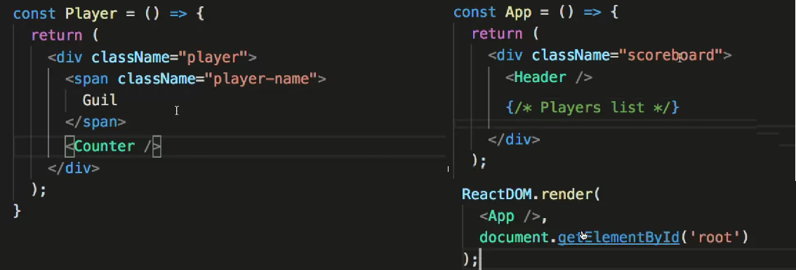

React facilitates the idea of reusable components, and keeps your application's data or at state and the UI in-sync and can efficiently update you UI when data changes.
This is one of the most difficult parts of building interactive user interfaces.

Being component based, you create your UI as individual self contained components.
At it's core React is only a library for creating and updating HTML elements in your UI.

To understand how React creates UI, start by using the React API to create React elements, the smallest building blocks of React apps.

It does not create actual DOM nodes - HTML elements in the way you would expect. Creates an `object` representation of a DOM node

We could describe our application's UI by using the React.createElement method over and over again. However, it's a lot of extra typing, and all of those `React.createElement` calls make things pretty confusing. This is where JSX comes in. JSX is an extension to the to the JS language that uses mark-up-like syntax to create React elements.

JSX is not valid JavaScript. It needs to be transpiled into `react.createElement` calls.
Normally during development, you'd have a build system set up with Babel in a tool like webpack. E.g. the tool create app provides a built system out of the box to do this.
But it's also possible to use babel directly in the browser (no build step) via a script tag that points to Babel stand alone:

**Components**

React elements are the smallest building blocks of React applications.
Now understand components, which are at the heart of React.
Everything in React is considered to be a component.

A component is a piece of UI that you can reuse. Just like you're able to reuse code in JavaScript with functions, a component lets you reuse code that renders a part of your UI. This enables you to split your UI code into independent, reusable pieces, and think about each piece in isolation.

So to start, our app might consist of three components.
A header component, a player component we can reuse to display each player and
score, and the container component that brings everything together.

JSX lets you define your own tags. A JSX tag can not only represent an HTML element e.g. `<h1>`, but it can also represent a user-defined component.  In `ReactDOM.render()`, replace the `header` variable with a header tag which exactly matches the name of the function:

A component's JSX tag is actually a function call the `ReactDOM.createElement()` under the hood.

Create the player component which will a player's name and a counter that displays the player's score, with buttons that let you change the score.:

Having parent components like `Player` with one or many child components (composition) gives the parent component the ability to control how its child components are rendered.

Typically, React applications have a single top level component that wraps the entire application and composes all the main components together.
`ReactDOM.render` usually renders your top level element into the DOM.
So now to create a new function component named App and pass it to `ReactDOM.render` using its JSX tag.

With React, we never touch the actual DOM directly - React only manages what gets rendered into the DOM - so it can be tricky to debug your UI in the browser. The React Developer Tools extension allows you to inspect your component hierarchy similar to how your inspect your HTML elements in the elements pane. Also notice and make use of the React tab and the search bar

**Props**

We use properties, or props, to customize our components and pass dynamic information into them.
HTML elements accept attributes that give them further meaning and additional behavior. Every React component and element can receive a list of attributes just like HTML elements. These are props, a core concept in React, because it's how we get data into a component.

First, you write props in a component's JSX tag, using an attribute syntax.
Then the component needs to be able to take in that information and use it in some way.

We can inspect the props of a element and a component in React DevTools:

Let's enable the use of props in our Header component by giving our function a parameter called props.
Remember, the JavaScript you write between the curly braces needs to be an expression or something that returns a value.

