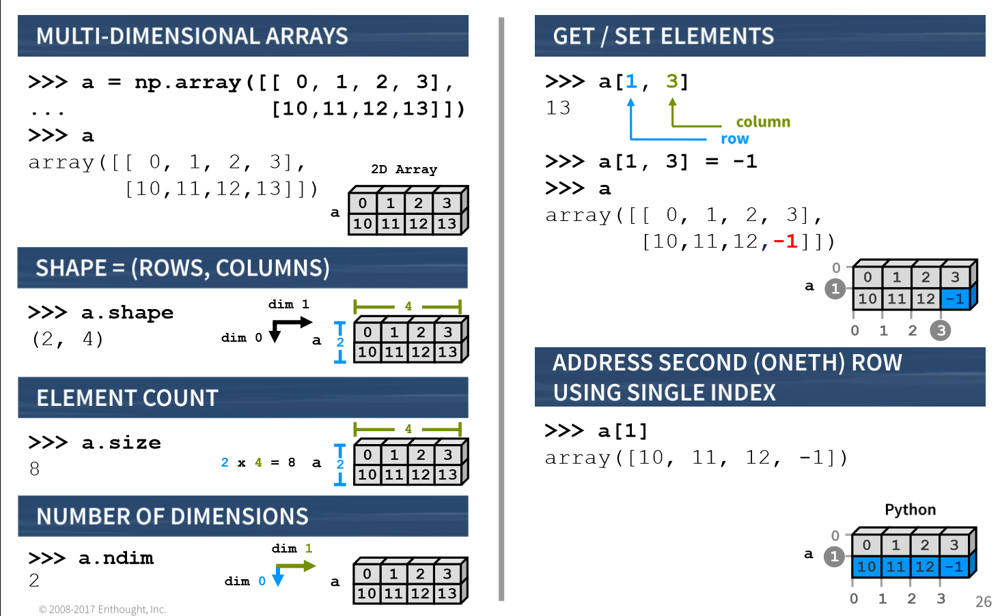
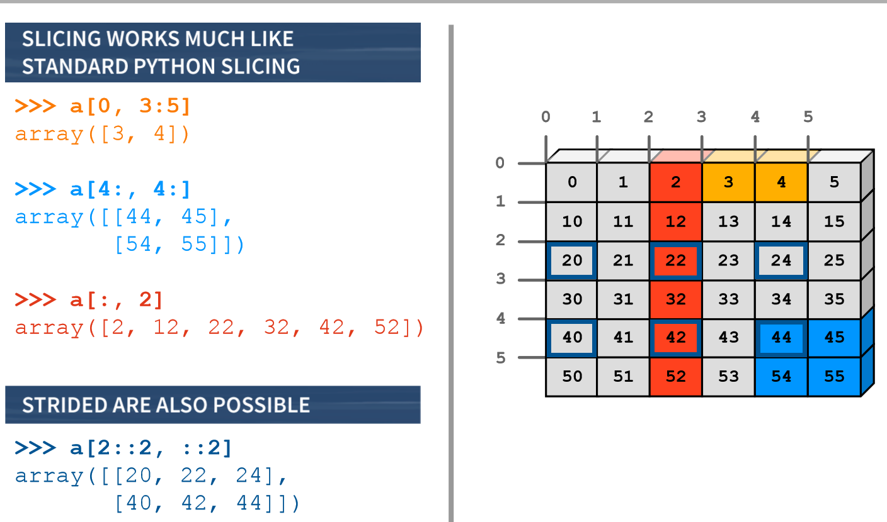

An extension module for Python, mostly written in C. This makes sure that the precompiled mathematical and numerical functions and functionalities of Numpy guarantee great execution speed.

NumPy enriches Python with powerful data structures, implementing multi-dimensional arrays and matrices. These data structures guarantee efficient calculations with matrices and arrays. The implementation is even aiming at huge matrices and arrays, better know under the heading of "big data". Besides that the module supplies a large library of high-level mathematical functions to operate on these matrices and arrays.

The main benefits of using numpy arrays should be smaller memory consumption and better runtime behaviour.

    >>> my_array = np.array([1,2,3,4,5])
    >>> my_array * 5  #scalar multiplication
    array([ 5, 10, 15, 20, 25])

**The N-dimensional array (ndarray)**

Multidimensional container of items of the same type and size. number of dimensions and items in an array is defined by its shape. The type of items in the array is specified by a separate data-type object (dtype)

`np.arange()` and `np.linspace()` create a NumPy array of evenly-spaced values. The third value that you pass to this function is the step value.

    >>> np.arange(4)
    array([0, 1, 2, 3])
    >>> np.arange(10,25,5)
    array([10, 15, 20])

    >>> np.ones((3,4))
    array([[ 1.,  1.,  1.,  1.],
           [ 1.,  1.,  1.,  1.],
           [ 1.,  1.,  1.,  1.]])
    >>> z = np.zeros((2,3))

    >>> np.random.random((3,4))
    array([[ 0.3099328 ,  0.06101578,  0.45957361,  0.16043293],
           [ 0.14784013,  0.68725461,  0.62947051,  0.43190797],
           [ 0.32508716,  0.14852979,  0.17178153,  0.37648012]])

    >>> np.linspace(0,2,9)
    array([ 0. ,  0.5,  1. ,  1.5,  2. ])

The dimensions of your arrays need to be compatible. Two dimensions are compatible when they are equal
What if they are not equal or if one of them is not equal to 1?
You’ll have to fix this by manipulating your array (see below)

**Aggregate functions**

    >>> np.arange(10,25,5).sum()
    45
    >>> np.arange(10,25,5).min()
    10
    >>> np.arange(10,25,5).mean()
    15.0

**Slicing arrays**

    >>> Z = np.array([[0,0,0,0,0,0],
                      [0,0,0,1,0,0],
                      [0,1,0,1,0,0],
                      [0,0,1,1,0,0],
                      [0,0,0,0,0,0],
                      [0,0,0,0,0,0]])
    >>> Z[:,3]
    array([0, 1, 1, 1, 0, 0])
    >>> A = Z[1:5,1:5]
    >>> A[0,0] = 9
    >>> print(A)
    [[9 0 1 0]
     [1 0 1 0]
     [0 1 1 0]
     [0 0 0 0]]

    # Assignment:
    A[2,3] = 5
    # Overwrite a column:
    A[:,2] = 5

**Manipulating arrays**

Transposing an array permutes the dimensions of it, in other words, you switch around the shape of the array.

    >>> a = np.array([[1,2,3],[4,5,6]])
    >>> np.transpose(a)
    array([[1, 4],
           [2, 5],
           [3, 6]])

In order to be good candidates for arithmetic operations, the dimensions of your arrays must be compatible.
`np.resize()` can be useful if your dimensions are not all the same.

    >>> x = [[1,2],
             [3,4]]
    >>> np.resize(x, (2,4))
    array([[1, 2, 3, 4],
           [1, 2, 3, 4]])

`np.reshape()` will give a new shape to an array without changing its data. The key to reshaping is to make sure that the total size of the new array is unchanged. If you take the example of array x that was used above, which has a size of 3 X 4 or 12, you have to make sure that the new array also has a size of 12.

    >>> y = np.array([[1, 2, 3, 4], [5, 6, 7, 8], [9, 10, 11, 12]])
    >>> y.shape
    (3, 4)
    >>> y.size
    12
    >>> np.reshape(y, (4, 3))
    array([[ 1,  2,  3],
           [ 4,  5,  6],
           [ 7,  8,  9],
           [10, 11, 12]])

`np.ravel` flatten it all out to a 1-D array:

    >>> np.ravel(y)
    array([ 1,  2,  3,  4,  5,  6,  7,  8,  9, 10, 11, 12])

`np.vstack((a,b))` and `np.hstack((a,b))` to concatenate:

    >>> a = np.ones((2,2))
    >>> b = np.zeros((2,2))
    >>> np.vstack((a,b))
    array([[ 1.,  1.],
           [ 1.,  1.],
           [ 0.,  0.],
           [ 0.,  0.]])
    >>> np.hstack((a,b))
    array([[ 1.,  1.,  0.,  0.],
           [ 1.,  1.,  0.,  0.]])

`np.concatenate()` is a general purpose version of `hstack` and `vstack`. Specify the axis keyword argument, concatenating along the first axis is similar to `vstack`, second axis is similar to `hstack`:

    >>> a = np.array([[1, 2], [3, 4]])
    >>> b = np.array([[5, 6]])
    >>> np.concatenate((a, b), axis=0)
    array([[1, 2],
           [3, 4],
           [5, 6]])
    >>> np.concatenate((y, np.array([[11, 12, 13, 14]])), axis=0)
    array([[ 1,  2,  3,  4],
           [ 5,  6,  7,  8],
           [ 9, 10, 11, 12],
           [11, 12, 13, 14]])
    >>> np.concatenate((a, b), axis=None)
    array([1, 2, 3, 4, 5, 6])

**Array Comparisons and Subsetting**

    >>> a = np.arange(0,10)
    >>> a > 5
    array([False, False, False, False, False, False,  True,  True,  True,  True], dtype=bool)

    >>> a = np.zeros((6,6))
    >>> a[1::3,:] = 4
    >>> a[::3,:] = 6
    >>> a
    array([[ 6.,  6.,  6.,  6.,  6.,  6.],
           [ 4.,  4.,  4.,  4.,  4.,  4.],
           [ 0.,  0.,  0.,  0.,  0.,  0.],
           [ 6.,  6.,  6.,  6.,  6.,  6.],
           [ 4.,  4.,  4.,  4.,  4.,  4.],
           [ 0.,  0.,  0.,  0.,  0.,  0.]])
    >>> bool_ary = (a[:,4] >= 4) & (a[:,5] < 6)
    >>> bool_ary
    array([ True, False, False,  True, False, False], dtype=bool)
    a[bool_ary, 2:]
    array([[ 6.,  6.,  6.,  6.],
           [ 6.,  6.,  6.,  6.]])

**Matrices**

n.b. This class may be removed in future versions; just use normal ndarrays. Numpy matrices are strictly 2-dimensional, while arrays (ndarrays) are N-dimensional. Matrix objects are a subclass of ndarray, so they inherit all the attributes and methods of ndarrays.
The main advantage of numpy matrices is that they provide a convenient notation for matrix multiplication: if a and b are matrices, then a*b is their matrix product.

    >>> a=np.mat('4 3; 2 1')
    >>> b=np.mat('1 2; 3 4')
    >>> a * b
    matrix([[13, 20],
            [ 5,  8]])
