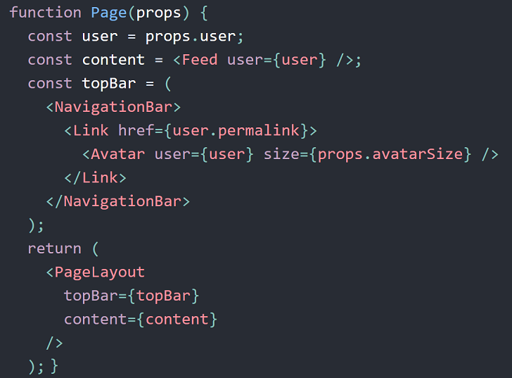
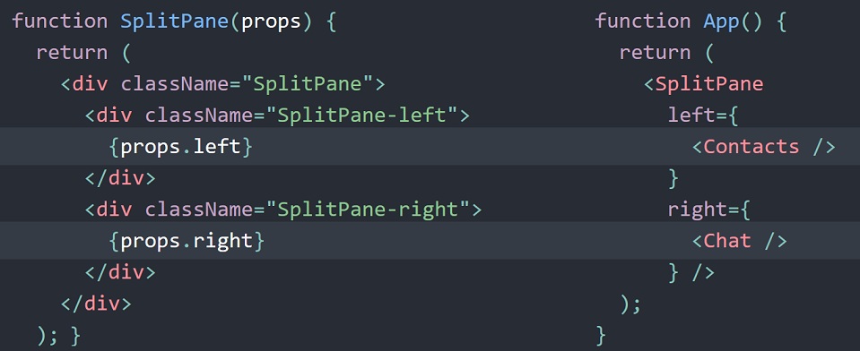
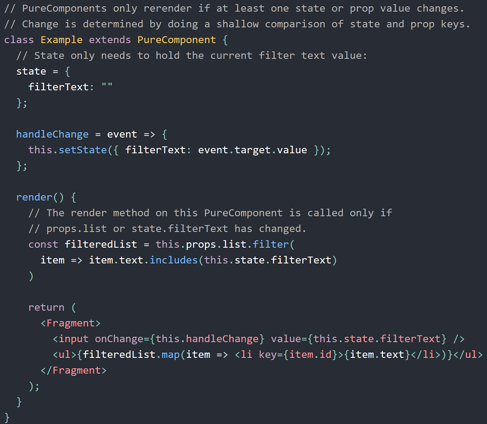

Conditional rendering
---------------------
There are various ways, as follows. Whenever conditions become too complex, it might be a good time to extract a component.

**Element Variables**

While declaring a variable and using an if statement is a fine way to conditionally render a component, sometimes you might want to use a shorter syntax. There are a few ways to inline conditions in JSX:

**Inline If with Logical `&&` Operator**

This works because `true` is ignored/not rendered and if it is not `true` the overall expression evaluates to `false`

**Inline If-Else with Conditional Operator**

Conditionals and short-circuit evaluation
-----------------------------------------
    <Fragment>
      {showMyComponent
        ? <MyComponent />
        : <OtherComponent />}
    </Fragment>

    <Fragment>
      {showPopup && <Popup />}
      ...
    </Fragment>

Lifting state up
----------------
Often, several components need to reflect the same changing data. We recommend lifting the shared state up to their closest common ancestor. Let’s see how this works in action.
In this section, we will create a temperature calculator that calculates whether the water would boil at a given temperature...
 In React, sharing state is accomplished by moving it up to the closest common ancestor of the components that need it. This is called “lifting state up”. We will remove the local state from the TemperatureInput and move it into the Calculator instead. If the `Calculator` owns the shared state, it becomes the “source of truth” for the current temperature in both inputs. It can instruct them both to have values that are consistent with each other. Since the props of both `TemperatureInput` components are coming from the same parent `Calculator` component, the two inputs will always be in sync.
https://reactjs.org/docs/lifting-state-up.html

Composition
-----------

**Containment and the children prop**

Some components don’t know their children ahead of time. The special `children` prop can be used to pass children elements directly into their output.

The component below which contains an `` that is receiving some `props` and then it is displaying `{props.children}`.

Whenever this component is invoked `{props.children}` will also be displayed and this is just a reference to what is between the opening and closing tags of the component.

    const Picture = (props) => {
      return (
        

          
          {props.children}
        

      )
    }

    //App.js
    render () {
      return (
        

          <Picture key={picture.id} src={picture.src}>
              //what is placed here is passed as props.children
          </Picture>
        

      )
    }

This de-couples the `<Picture>` component from its content and makes it more reusable.
Common for components like `Sidebar` or `Dialog` that represent generic “boxes”.

In composition, a more “specific” component renders a more “generic” one and configures it with props:

You’re not limited to a single child for a component, you may pass multiple children:

...or even have multiple separate “slots” for children if needed:

You probably don't need derived state
-------------------------------------
`getDerivedStateFromProps` exists for this purpose, and this only.
`getDerivedStateFromProps` (and derived state in general) is an advanced feature and should be used sparingly because of this complexity.

when designing a component, it is important to decide whether its data will be controlled or uncontrolled.
The terms “controlled” and “uncontrolled” usually refer to form inputs, but they can also describe where any component’s data lives.
Data passed in as props can be thought of as controlled (because the parent component controls that data). Data that exists only in internal
state can be thought of as uncontrolled (because the parent can’t directly change it).

The most common mistake with derived state is mixing these two; when a derived state value is also updated by `setState` calls,
there isn’t a single source of truth for the data. For any piece of data, you need to pick a single component that owns it as the source of truth,
and avoid duplicating it in other components.

Solutions to problems with using derived state:

1) Use a fully controlled component -  remove state from our component entirely, so the email address only exists as a prop, so no potential conflicts with state.

2. Fully uncontrolled component with a `key` - here our component fully owns the “draft” email state, so our component could still accept a prop for the initial
value, but would ignore subsequent changes to that prop:

When a key changes, React will create a new component instance rather than update the current one. Keys are usually used for dynamic lists but are also useful
here. In our case, we could use the user ID to recreate the email input any time a new user is selected

With this approach, you don’t have to add `key` to every input. It might make more sense to put a key on the whole form instead.
Every time the key changes, all components within the form will be recreated with a freshly initialized state.
In most cases, this is the best way to handle state that needs to be reset.

**Memoization**

Derived state can be used to ensure an expensive value used in `render` is recomputed only when the inputs change (memoization).
Derived state for memoization is not usually the best approach due to inherent complexity in managing derived state.

In an example of one component that takes one prop - a list of items - and renders the items that match a search query entered by the user.
We could use derived state to store the filtered list, but we would have to separately track and detect changes in both props and state in order
to properly update the filtered list. We could simplify things by using `PureComponent`:

Occasionally, this won’t be good enough - filtering may be slow for large lists, and `PureComponent` won’t prevent rerenders if another prop were to change.
To address both of these concerns, we could add a memoization helper to avoid unnecessarily re-filtering our list:

*n.b* In most cases, you’ll want to attach the memoized function to a component instance. Typically you’ll want to use a memoization helper with a limited
cache size in order to prevent memory leaks over time (memoize-one used above as it only caches the most recent arguments and result).
None of the implementations above will work if `props.list` is recreated each time the parent component renders.

