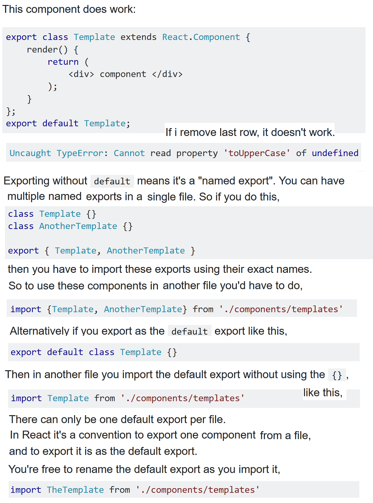

**`setState()`**

**Actions on state, where state is considered immutable**

Adding or Updating the value of a property:

    function updateState(state, item) {
      return {
         ...state,
         [item.id]: item
      };
    }

Note: `[item.id]` is computed property name syntax.

Deleting a property:

    function deleteProperty(state, id) {
        let  {[id]: deleted, ...newState} = state;
        return newState;
    }

Or even shorter as helper function:

    function deleteProperty({[id]: deleted, ...newState}, id) {
        return newState;
    }

    function deleteProperty(state, id) {
        return (({[id]: deleted, ...state}) => state)(state);
    }

**Stringify state used in `render`**

  render() {
    ...
    return (
      

        {fields}
        
{JSON.stringify(this.state)}

      

    );
  }

**Curried function example**

    handleChange = field => e => {
          e.preventDefault()
          /// Do something here
        }

We'll start by representing it without using arrow functions …

    handleChange = function(field) {
      return function(e) {
        e.preventDefault()
        // Do something here
        // return ...
      };
    };

However, because arrow functions lexically bind this, it would actually look more like this …

    handleChange = function(field) {
      return function(e) {
        e.preventDefault()
        // Do something here
        // return ...
      }.bind(this)
    }.bind(this)

Maybe now we can see what this is doing more clearly. The `handleChange` function is creating a
function for a specified field. This is a handy React technique because you're required to setup
your own listeners on each input in order to update your applications state.
By using the `handleChange` function, we can eliminate all the duplicated code that would result
in setting up change listeners for each field.

Miscellaneous JSX notes
------------------------------------

**Props Default to “True”**

If you pass no value for a prop, it defaults to true. These two JSX expressions are equivalent:

    <MyTextBox autocomplete />

    <MyTextBox autocomplete={true} />

In general, we don’t recommend using this because it can be confused with the ES6 object shorthand `{foo}` which is short for `{foo: foo}` rather than `{foo: true}`. This behavior is just there so that it matches the behavior of HTML.

**Spread operator with props**

If you already have `props` as an object, and you want to pass it in JSX, you can use `...` as a “spread” operator to pass the whole props object. These two components are equivalent:

    function App1() {
      return <Greeting firstName="Ben" lastName="Hector" />;
    }

    function App2() {
      const props = {firstName: 'Ben', lastName: 'Hector'};
      return <Greeting {...props} />;
    }

**Children in JSX**

In JSX expressions that contain both an opening tag and a closing tag, the content between those tags is passed as a special prop: `props.children`. There are several different ways to pass children:

String literals (note that HTML is unescaped):

    <MyComponent>Hello world!</MyComponent>

    
This is valid HTML &amp; JSX at the same time.

JSX Children (useful for displaying nested components):

    <MyContainer>
      <MyFirstComponent />
      <MySecondComponent />
    </MyContainer>

**JS expressions as children**

    function TodoList() {
      const todos = ['finish doc', 'submit pr', 'nag dan to review'];
      return (
        <ul>
          {todos.map((message) => <Item key={message} message={message} />)}
        </ul>
      );
    }

`export default`
----------------

